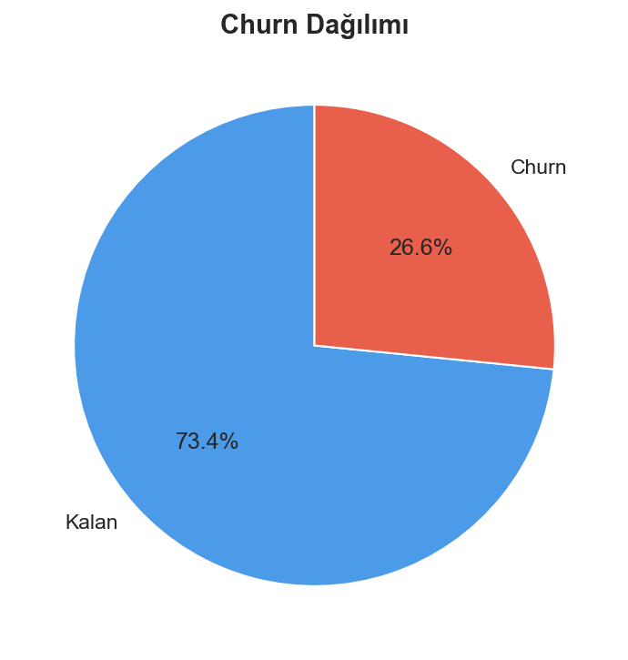
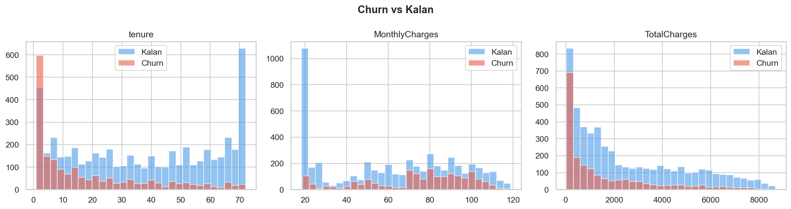
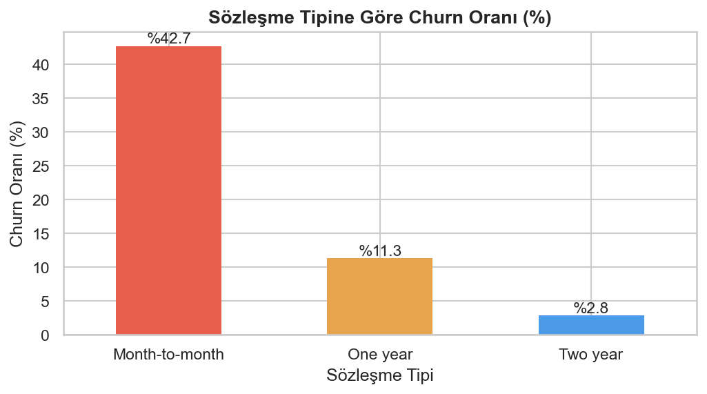
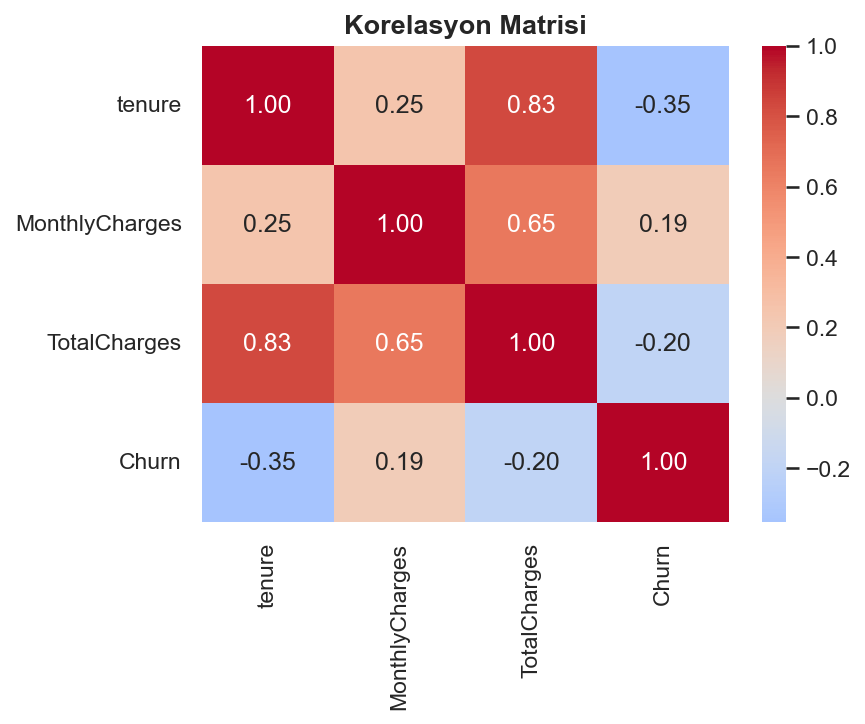
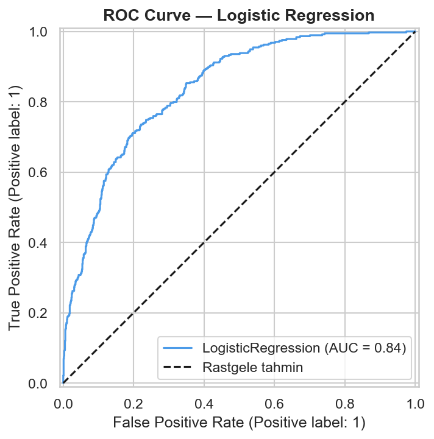
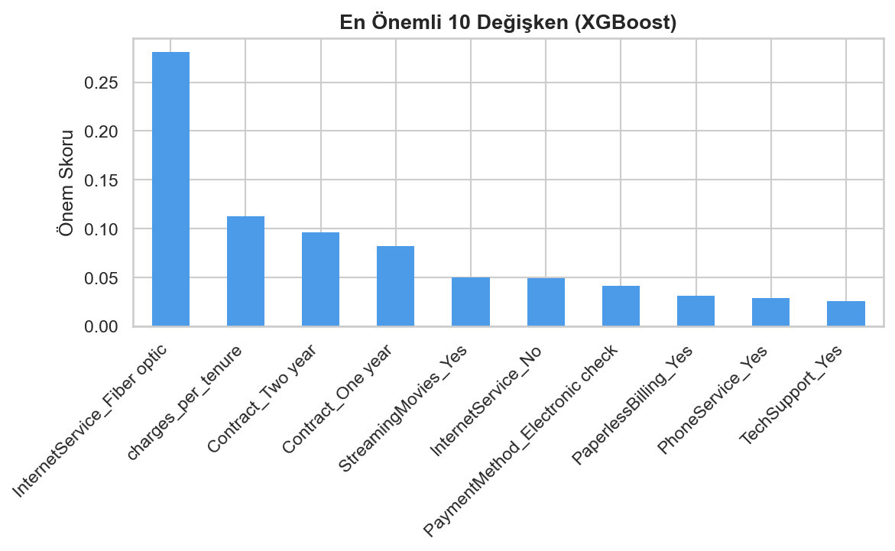
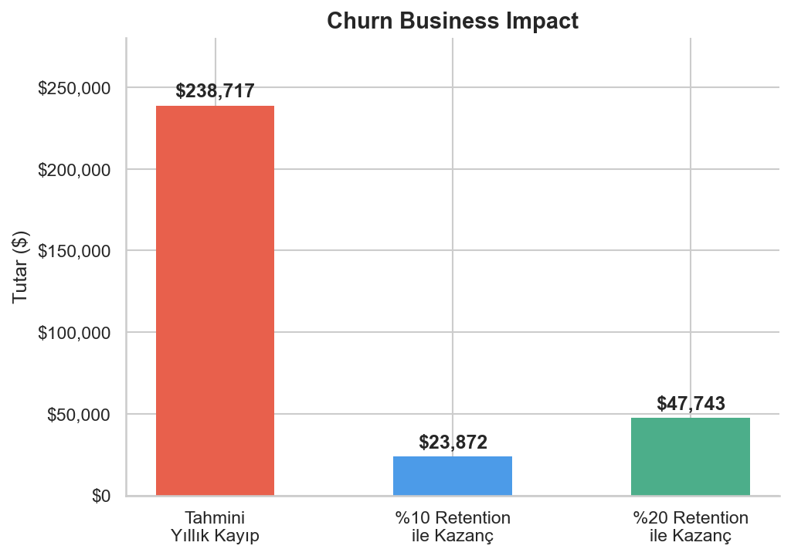
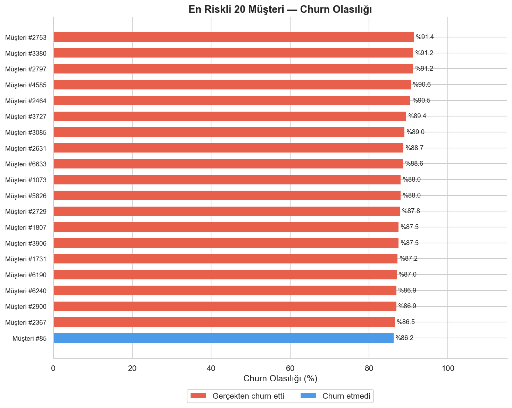

# 📉 Telco Customer Churn Analysis

Telco müşteri verisi üzerinde uçtan uca churn tahmin pipeline'ı:  
EDA → Feature Engineering → Model Karşılaştırma → Business Impact

---

## 🎯 Proje Özeti

| | |
|---|---|
| **Veri** | IBM Telco Customer Churn (7,032 müşteri) |
| **Hedef** | Churn eden müşteriyi önceden tahmin et |
| **En iyi model** | Logistic Regression — AUC: **0.84** |
| **Tahmini yıllık kayıp** | **$238,717** |

---

## 📊 Görseller

### Churn Dağılımı


### Sayısal Değişkenler: Churn vs Kalan


### Sözleşme Tipine Göre Churn Oranı


### Korelasyon Matrisi


### ROC Curve


### En Önemli 10 Değişken (XGBoost)


### Business Impact


### En Riskli 20 Müşteri


---

## 🔍 Temel Bulgular

- **Churn oranı %26.6** — veri dengesiz, modelde buna dikkat edildi
- **Month-to-month sözleşmede churn %42.7** — en kritik risk segmenti
- **Fiber internet kullanıcıları** en fazla churn eden grup (feature importance 1. sıra)
- **charges_per_tenure** (türetilen değişken) modelde 2. sıraya girdi — feature engineering'in etkisi
- Logistic Regression (AUC 0.84) ve XGBoost (AUC 0.839) benzer performans gösterdi; bu veri setinde doğrusal ilişkilerin baskın olduğuna işaret ediyor

---

## 🛠️ Kullanılan Teknolojiler


- **EDA:** Pandas, Seaborn, Matplotlib
- **Feature Engineering:** Tenure grupları, charges_per_tenure oranı
- **Modeller:** Logistic Regression, XGBoost
- **Metrikler:** ROC-AUC, Confusion Matrix, Classification Report

---

## 🚀 Nasıl Çalıştırılır

```bash
# 1. Repoyu klonla
git clone https://github.com/mustafkurtx-droid/telco-churn-analysis.git
cd telco-churn-analysis

# 2. Kütüphaneleri yükle
pip install -r requirements.txt

# 3. Notebook'u aç
jupyter notebook DSProje.ipynb
```

---

## 📁 Dosya Yapısı

```
telco-churn-analysis/
│
├── DSProje.ipynb                          # Ana notebook
├── WA_Fn-UseC_-Telco-Customer-Churn.csv  # Veri seti
├── requirements.txt                       # Bağımlılıklar
└── gorseller/                             # Görseller
    ├── 01_churn_dagilimi.png
    ├── 02_sayisal_dagilim.png
    ├── 03_sozlesme_churn.png
    ├── 04_korelasyon.png
    ├── 05_roc_curve.png
    ├── 06_feature_importance.png
    ├── 07_business_impact.png
    └── 08_top20_risk.png
```

---

## 📌 CV Bullet Point

> *Telco müşteri verisi (7K satır) üzerinde EDA, feature engineering ve Logistic Regression / XGBoost ile churn tahmin modeli kurdum. ROC-AUC: 0.84. Modelin tespit ettiği churn müşterilerinin tahmini yıllık business impact'i $238K olarak hesaplandı.*
